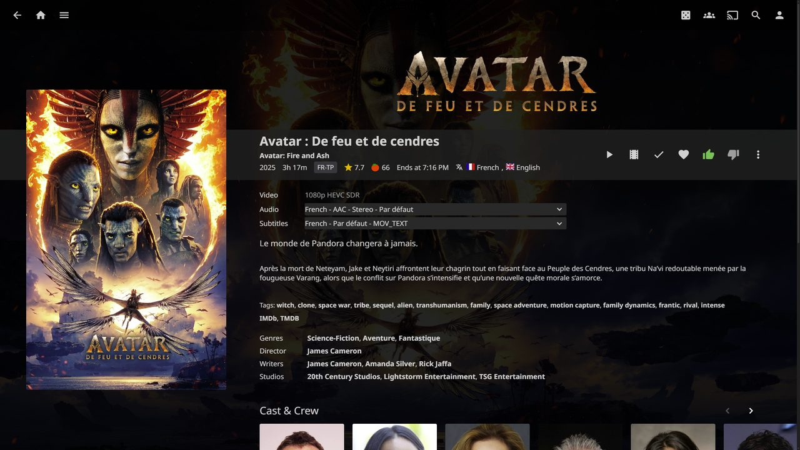
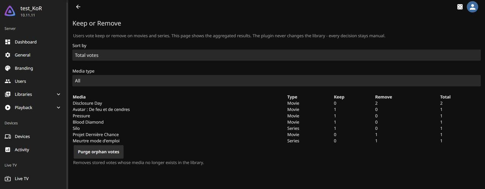

# Keep or Remove

<p align="center">
  
  
  
  
</p>

A small, **temporary** Jellyfin plugin. While server storage is limited, it lets a handful of users say which movies and series they still want kept and which can be removed, and gives the admin a plain aggregated table to decide the rotation manually.

The plugin is **decision-support only**. It never deletes, adds, moves, or modifies any media, metadata, or file. It never auto-rotates and never enforces a majority. The admin keeps full control.

Part of the [JellyUX](https://github.com/Samuellct/JellyUX-Homepage) plugin family.

---

## Prerequisites

- **Jellyfin 10.11.11**. Other versions may work but are not officially supported.
- **[File Transformation plugin](https://github.com/IAmParadox27/jellyfin-plugin-file-transformation)**
  - required, used to inject the vote buttons into the web client. If it is missing, the plugin's config page shows a warning and no buttons appear.

## Installation

1. Jellyfin dashboard: **Plugins > Repositories > Add**, paste:
   ```
   https://raw.githubusercontent.com/Samuellct/Keep_or_Remove/main/manifest.json
   ```
2. **Plugins > Catalog**, install **Keep or Remove**.
3. Restart Jellyfin.

## Usage

- On any movie or series page, users see two buttons: **Keep** (green thumb up) and **Remove** (red thumb down). One vote per user per title. Clicking the other choice replaces the vote. Clicking the active choice again clears it. Season and episode pages vote for the parent series.
- The admin sees the aggregated results on **Dashboard > Plugins > Keep or Remove**: a `Media / Type / Keep / Remove / Total` table, sortable by keep or remove count and filterable by media type, plus a **Purge orphan votes** button that drops votes whose media no longer exists.
- Other users' votes are never shown on media pages.

## Screenshots





## Compatibility

The vote buttons are a **web-client** feature. For clients not using the web client, the native UI is shown unchanged and voting buttons are unavailable.

## Tested alongside

Keep or Remove is designed to coexist with other plugins that customise the Jellyfin experience. It has been run together with all of the following on the same server without conflict:
- **[File Transformation](https://github.com/IAmParadox27/jellyfin-plugin-file-transformation)** by IAmParadox27 (the injection mechanism this plugin relies on)
- **[Media Bar](https://github.com/IAmParadox27/jellyfin-plugin-media-bar)** by IAmParadox27
- **[Jellyfin Enhanced](https://github.com/n00bcodr/Jellyfin-Enhanced)**
- **[Intro Skipper](https://github.com/intro-skipper/intro-skipper)**

If an expected anchor in the page is missing, the plugin skips its own injection silently rather than risk breaking the web client.

## Clean removal

All persistent data lives in **one directory**:
`<jellyfin-data>/Jellyfin.Plugin.KeepOrRemove/` (it holds a single `votes.json`). To remove the plugin with zero residue:

1. **Dashboard > Plugins > Keep or Remove > Uninstall**, then restart Jellyfin.
2. Delete `<jellyfin-data>/Jellyfin.Plugin.KeepOrRemove/`.

The server is then left exactly as it was. The plugin creates no database tables, no scheduled tasks, and no files anywhere else.

## License

GPL-3.0. See [`LICENSE.md`](LICENSE.md).
